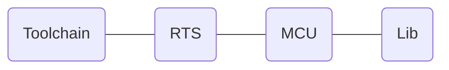

# AVR-Ada
   


## History

The development for AVR-Ada started in 2004 (or even before, I don't remember). I read somewhere around that time that the new AVR processors have many registers (32) to support high level languages.  And then the article continued to use C. Having used Ada in the 1990ies I considered Ada a much more appropriate choice for a high level language.

I plunged into building gcc as a cross compiler and activating the Ada frontend. I learned a lot about GCC's internals and GNAT's run-time-system. I started to write scripts for building the compiler and the binutils (linker, assembler, and other tools), developed a minimalistic run-time-system, and a support library for the on-chip or on-board peripherals. Providing all the different parts to other users was always the most tedious part.

AVR-Ada was once part of the popular WinAVR distribution in 2009, which was the most user friendly installation so far. It was limited to Windows only, but everything was included and it was nicely integrated in the development environment of that time AVR-Studio. Before and after that the installation was quite awkward.

AdaCore also distributed an AVR cross-compiler in 2011 and 2012.  There were only pin and register definitions for a single target and no driver library at all. The compiler itself was probably more stable than the one from AVR-Ada.

## Purpose

AVR-Ada strives to provide a more or less complete compilation environment targeting the 8-bit AVR micro-controllers. It is **not** an integrated development environment like Emacs, GNAT-Studio, AVR-Studio or the newer VS Code but integrates well into each of them.

More specifically the project provides:
- a GNAT compiler based on the existing AVR and Ada support in GCC  
- a minimalistic Ada runtime system  
- register and pin definitions for many (almost 100) AVR micro-controllers
- an extensive and useful AVR specific support library  
- support packages for accessing LCDs, Dallas' 1-wire sensors, or several humidity and temperature sensors
- some sample programs that show how to use the compiler and the library.

Some applications that had been built using AVR-Ada:  
- a data logger for a weather station  
- a closed loop heating control system  
- an astronomical "GoTo" mount for a telescope on an AVR90USB128  
- a small robot based on the Asuro platform  
- a limited IP stack with ARP, ICMP and UDP (no TCP)  
- sample programs for the very popular Arduino platform
 

## Usage

The simplest things to get you started are an Arduino board and a USB cable to connect it to your computer.

The typical "Hello World" program is a blinking LED in the embedded world.  The standard Arduino boards already have a LED between B5 (pin 5 of port B, labeled "D13" ) and ground.  You have to set the pin to high level to switch it on.

### Check out the Examples

The easiest way to get you going is to get the examples.  They will install the necessary compiler and environment with the help of Alire. 

So, first get the examples: 
```bash
alr get avrada_examples
```
step into the crate and then go into `delays`.  You now have to tell Alire about the dependencies. 

###  Install the Compiler Environment

That is done issuing the command 
```bash
alr update
```
It proposes to install 

- the cross compiler (`gnat_avr_elf`), 
- the compiler's minimal run time system (`avrada_rts`),
- the register definitions of the various supported AVR processors (`avrada_mcu`),
- and a library of drivers for the on-board peripherals like timers and useful functions like string manipulation (`avrada_lib`).

That already lists the four building blocks of AVR-Ada (see below). Simply hit the Enter key to confirm the choice and Alire will install the mentioned toolchain and the other crates.

### Compilation 

Simply run `alr build` or `make`. Alire and the GNAT project manager will compile, bind and link all the necessary files. It will show some warnings in `avr-real_time.adb` ('warning: unrecognized pragma "NOT_IMPLEMENTED"') as some procedures are not yet implemented. In the end you have built three programs `blink_busy.elf`, `blink_clock.elf`, and `blink_rel.elf`.

### Upload
You have to know which port is used in your OS for the connected Arduino. Probably it is something like `com1:` on Windows or `/dev/ttyUSB0` on Linux. Windows has a device manager if you are unsure. You have to set that port in the `Makefile` at line 67. Set the variable `AVRDUDE_PORT` to whatever the OS choose. 

You can then upload your program to the Arduino by
```bash
make blink_busy.prog
```


## Design

### AVR-Ada Split into Modular Crates
Originally AVR-Ada provided a one stop shop solution including everything in a single download. It was tedious to maintain and to explain how everything works together. With the repackaging of AVR-Ada in Alire I took the chance to apply a modular approach. AVR-Ada is now split into five separate crates following the examples of other bigger packages (e.g. gnatcoll, Ada_Drivers_Library)

1. **Toolchain**: AdaCore provides download packages of the AVR cross-compiler for Windows and Linux. It can be installed easily by the `alr toolchain` command.
2. **RTS**: The GNAT Run-Time-System, very minimalistic, but supports local exceptions and tagged types. The files were borrowed  from  subsets  of  GNAT's RTS and then carefully tailored to the AVR architecture. The Alire crate is [`avrada_rts`](https://alire.ada.dev/crates/avrada_rts).
3. **MCU**: Pin and register definitions of nearly 100 devices. The Alire crate is [`avrada_mcu`](https://alire.ada.dev/crates/avrada_mcu).
4. **Lib**: A support library for on- and off-board peripherals (e.g. timers, interrupts, string handling). The library strives to abstract away many of AVR's irregularities among the different  MCUs. There is on one side drives for the on-chip capabilities, like GPIO, timers, A/D  converters, UART, etc. On the other side the library provides some functionality that  is typically in the Ada run time system or standard library, like real-time functions or  string handling functions.  
The main incentive to write special packages in the AVR hierarchy instead of the Ada  hierarchy are the size constraints of the 8bit micro controllers. Some of them only  have a few bytes of RAM. You then think twice if you want your string variables indexed by a 8bit wide or 16bit wide index. The Alire crate is [`avrada_lib`](https://alire.ada.dev/crates/avrada_lib).
5. **Examples**: Some example programs using the above crates. The Alire crate is [`avrada_examples`](https://alire.ada.dev/crates/avrada_examples).

Alire allows to describe their dependencies and versions. That alone turns maintenance a lot easier.

### Code Re-Use Across Different Micro-Processors

#### Generic Microcontroller Definitions

As there are so many different AVR micro-controllers you generally want to reuse your code in new projects with different controllers. It is therefor highly recommended *not* to refer to your specific controller in your Ada code. Use a generic renaming instead.
That is, instead of
```Ada
with AVR.atmega328p;     use AVR.atmega328p;
```
you better use
```Ada
with AVR.MCU;            use AVR.MCU;
```
and define the actual processor at a single location. See Alire configuration variables below.

#### Preprocessor

That aforementioned technique works at an algorithmic level. But sometimes you have to dive into the low level details of registers and pin names. In order to keep the resulting code as re-usable as possible the AVR-Ada drivers make heavy use of the GNAT preprocessor. The AVR controllers tend to have different names on different controllers for actually the same thing. You will see a lot of code like this
```Ada
   procedure Enable_External_Interrupt_0 is
   begin
#if MCU = "attiny85" then
      MCU.GIMSK_Bits (MCU.INT0_Bit) := True;
#elsif MCU = "atmega162" then
      MCU.GICR_Bits (MCU.INT0_Bit) := True;
#else
      MCU.EIMSK_Bits (MCU.INT0_Bit) := True;
#end if;
   end Enable_External_Interrupt_0;
```
The interrupt mask register is called `GIMSK` on an attiny85, `GICR` on the atmega162, and `EIMSK` on most other controllers.

If you want to add a new microprocessor or want to code different solutions for different controllers you can use the preprocessor variable `MCU` and the name of the controller. For the most part, the use of the preprocessor is limited to the internals of the support library.  The  library  makes heavy  use  of  the  GNAT  preprocessor.  All  compilations  have  the  symbol of the respective MCU name and the UART/Serial interface distinguishes between UART, USART, USART0, and USART1 for example. See the file `mcu_capabilities.gpr`. Typical user code rarely has to resort to the preprocessor.

#### Capabilities and Controller Names

In an attempt to better organize the driver sources and to shorten the preprocessor lines in the source code I started to describe the capabilities of the different micro-controllers. Right now there is only a few capabilities extracted to `mcu_capabilities.gpr` (EEPROM_Width, name of the EEPROM Write Enable bit, and the name of the UART subsystem).

For GNAT package manager file `avrada_lib.gpr` puts several source files into groups for handling the different drivers. there is for example the `UART_Sources` or `Timer0_Sources` for handling the UART or the internal timer0, respectively. Depending on the name of the micro-controller the source file groups are made available for the support lib. Take a look at the lower part of `avrada_lib.gpr`. If there is any interest and as time permits most of these options could be moved to the Alire configuration variables.

### Alire configuration variables

Currently we mainly use two configuration variables. In the file `alire.toml` of your application you have to set the name of the micro-controller as a string and the speed of the processor as an integer. The  typical  Arduino  boards  have  an  atmeg328p  running  at  16MHz. 
```
[configuration.values]
avrada_rts.AVR_MCU = "atmega328p"
avrada_rts.Clock_Frequency = 16000000
```
In your project you can refer to the name of the micro-controller in the preprocessor variable MCU. The example above for the busy waiting blinking LED must know about the processor speed to generate an appropriate loop of `NOP` statements. It refers to the clock frequency as `Avrada_Rts_Config.Clock_Frequency`:
```Ada
procedure Wait_1_Sec is new
  AVR.Wait.Generic_Wait_USecs (Crystal_Hertz => Avrada_Rts_Config.Clock_Frequency,
                               Micro_Seconds => 1_000_000);
```
These are now compile time constants and permit to generate optimal code.

The  secondary  stack permits some fancy Ada constructs like returning unconstrained strings or class  values. The generated AVR object code requires quite some space, however. The reserved stack space are 63 bytes per default. If you generate bigger objects you can increase the stack with the configuration value of `Sec_Stack_Size`:
```
[configuration.values]  
avrada_rts.Sec_Stack_Size  =  100
```

There is a fourth configuration variable that is probably rarely used. If you want to use Timing Events you probably want them to be started at the timer tick. That can be achieved if you set `avrada_lib.Process_Timing_Events_In_Ticks` to True.

### Use of a `Makefile`
Despite the rich possibilities of the GNAT project manager (i.e. `gpr`-files) and now Alire in `alire.toml` there are still quite some recurring functionalities missing. Since the first days we therefore provide a `Makefile` with appropriate targets. 

If your program is called `sample` you can call the following commands:
- `make sample.prog`: that is probably the most important one, uploading the resulting binary to the target after generating appropriate ihex and eep files for flash and EEPROM.
- `make sample.size`: show the absolute and relative use of flash and eeprom memory.
- `make sample.s`: generate a commented AVR assembler file from `sample.adb`.  That proves to be very helpful for debugging or when you suspect problems in the pin definitions or in the driver code.
- `make`: the standard make target simply calls `alr build`to rebuild your application.

Most tasks of the Makefile can be delegated to Alire. Some commands, however, require the name of the target processor. A simple AWK one-liner extracts that information from the configuration in `alire.toml`.

## License

GPL-2.0-or-later WITH GCC-exception-3.1

